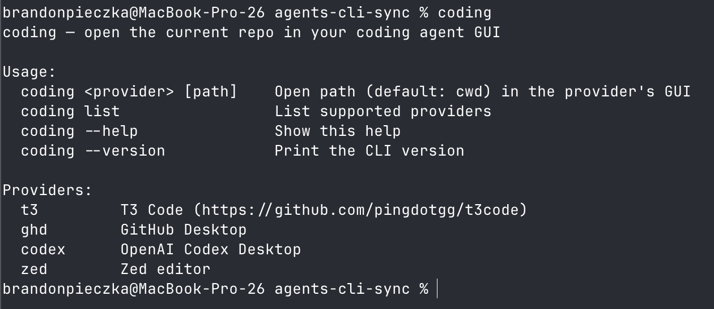

# agents-cli-sync

One CLI command to open any interface for coding from your active path.

Supports:
- T3 Code
- Zed
- Github Desktop
- Codex
- Cursor
- Cursor-Glass
- Orchids
- Virtual Studio Code

